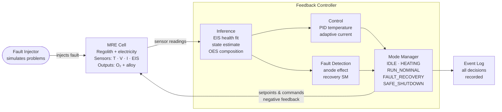
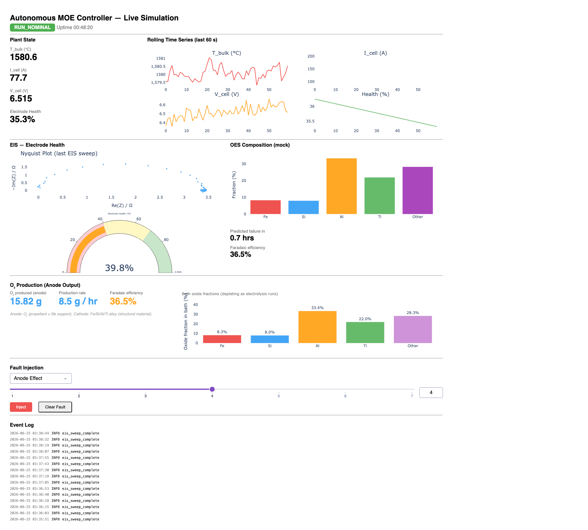

# MRE Controller Testbed

Simulation platform for an autonomous controller for Molten Regolith Electrolysis (MRE).

## What problem this solves

Molten Regolith Electrolysis is the leading candidate for in-situ resource utilisation on the Moon and Mars. Run current through molten regolith at ~1600°C, and you get oxygen at the anode (for propellant and life support) and a metal alloy at the cathode (structural material). The chemistry is proven. Boston Metal, Helios, and ESA have all demonstrated it at lab scale.

The unsolved problem is autonomous operation. On Earth, an experienced operator watches the cell, interprets subtle changes in voltage and current, decides when to replace an electrode before it fails, adjusts operating conditions as the bath composition drifts, and intervenes when something goes wrong. On the Moon, there is no operator. The system must make every one of those decisions itself, in real time, without human input.

No vendor currently supplies an autonomous control layer for MRE. That is the gap this project addresses.

## What this repository is

A simulation testbed for developing and validating that autonomous controller.

It is not a proof that the chemistry works — that is established. It is a software platform that:

1. Simulates an MRE cell (temperature dynamics, electrolysis physics, electrode degradation, bath composition evolution)
2. Runs an autonomous feedback controller against that simulation in a closed negative feedback loop
3. Lets you inject faults and observe whether the controller detects and recovers from them
4. Logs every sensor reading, inference, and command decision

The controller reads sensor data from the cell every second, estimates the current state of the process (electrode health, Faradaic efficiency, bath composition), and issues commands back to the cell. That loop runs continuously with no human decisions after the initial start.

## Architecture



The controller operates as a negative feedback loop. The MRE Cell produces sensor streams every second. The Feedback Controller reads those streams, estimates the current process state (electrode health, Faradaic efficiency, bath composition), and issues setpoints and commands back to the cell. Deviation from the desired operating point produces a corrective response. The Fault Injector injects controlled disturbances to test whether the controller detects and recovers correctly. The Event Log records every state transition and command.

## Setup

Requires Python 3.11+.

```bash
git clone https://github.com/Tocki28/MRE-controller-testbed
cd MRE-controller-testbed
python3.11 -m pip install -e ".[dev]"
python3.11 app.py
```

Open [http://127.0.0.1:8050](http://127.0.0.1:8050) in your browser.



The dashboard shows live sensor streams, EIS health gauge, O₂ production rate, and event log. To test fault recovery: select "Anode Effect" in the Fault Injection panel, set severity, click Inject. Watch the mode badge transition RUN_NOMINAL → FAULT_RECOVERY → RUN_NOMINAL.

To run tests:

```bash
python3.11 -m pytest tests/ -v
```

17 tests covering plant dynamics, mode transitions, and fault detection.

## What the simulation models

- **Temperature dynamics**: heater power input, Joule heating from electrolysis current, radiative loss, thermal noise
- **Electrode degradation**: health declines with current load; resistance increases as health falls
- **Faradaic efficiency**: drifts with electrode health and operating conditions
- **O₂ production**: computed from Faraday's law (2O²⁻ → O₂ + 4e⁻) based on current and efficiency
- **Bath oxide evolution**: Fe₂O₃, SiO₂, Al₂O₃, TiO₂ fractions deplete at rates governed by decomposition potentials and current density
- **EIS impedance**: synthetic Randles circuit spectrum generated from electrode health; fitted by least-squares to extract Rct; health estimate updated via exponential moving average
- **Fault dynamics**: anode effect modelled as a voltage spike multiplier with current ramp-down

## Limitations

This is a low-fidelity simulation. It is designed to exercise the controller architecture, not to replicate real cell behaviour quantitatively.

Specific known limitations:

- **Physics are approximate.** The plant model uses simplified Euler integration with noise. It will not match the transient behaviour of a real MRE cell.
- **EIS is synthetic.** The impedance spectra are generated from a Randles model with known parameters, then fitted back. This validates the fitting pipeline, not the claim that real molten-oxide EIS spectra behave this way.
- **Single cell, single fault type.** The current implementation handles one anode-effect fault. The full fault catalogue (melt freeze, electrode short, bath depletion, off-gas blockage) is not yet implemented.
- **No real hardware.** All sensor data is simulated. The controller has not been tested on a real electrochemical cell.
- **OES composition is mocked.** The composition panel reads directly from the plant state with added noise. A real OES inference pipeline is a separate workstream.

## What this does not do

- **Does not prove the chemistry.** MOE/MRE chemistry is proven in the literature (MIT, ESA, Boston Metal). This repository does not add to that.
- **Does not extract pure metals.** MRE produces a mixed Fe/Si/Al/Ti alloy at the cathode and O₂ at the anode. Pure metal separation requires downstream refining — a separate process not modelled here.
- **Does not run on embedded hardware.** The controller is Python running on a laptop. An embedded port (STM32, FreeRTOS) is a later milestone.
- **Does not connect to real instruments.** No OPC UA server, no hardware-in-the-loop, no AD5933 or Rodeostat integration in this version.
- **Does not validate against real lab data.** Validation against real molten-environment EIS data requires lab access and is tracked as a separate milestone.
